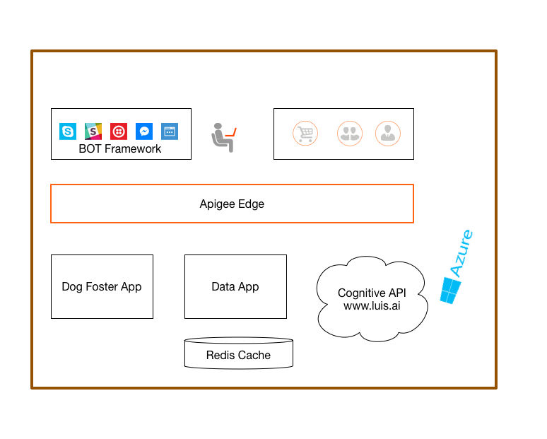

#Dog Fostering Bot

This demo is built on [Microsoft's BOT framework](https://dev.botframework.com/). The user can interact with the Dog Fostering Bot from his standard channels like Skype, Slack etc to get the information about the available dogs, schedule an appointment to pick up one. This Bot uses Microsoft's Connitive API: [LUIS](https://www.luis.ai/), allowing user to interact with the Bot in natural english.

All the APIs used by the Bot and exposed by the Bot to the channels like Slack, Skype etc are powered through Apigee. 
Apigee provides: 
- The API Management capabilities like Security, Traffic Management, Threat Protection, Credential mediation.
- API Model and developer on-boarding capabilities to make these APIs available to other applications, in addition to this Dog Fostering Bot
- Visibililty into operational, business aspects of the API. This demo also shows custom analyitcs. ex: which dogs are fostered more, which channels are the users coming from, for the Dog Bot etc.

##To run the demo:

###To hit the bot from Skype:
<a href='https://join.skype.com/bot/073d0f7f-32ea-4f01-b16c-cd8c3c46e4de'></a>

###To hit the bot from Slack:
<a href="https://slack.com/oauth/authorize?scope=bot&client_id=2192129203.61715517473&redirect_uri=https%3a%2f%2fslack.botframework.com%2fHome%2fauth&state=apigeedemodogbot"></a>

**Sample messages:** 

```
list all dogs
how many dogs do you have
tell me more about Pablo
can I foster Pablo

```

##Architecture:
This demo uses Redis Cache as the system of record where the information about dogs is stored. A Azure web application exposes the Data as an API. 
The Dog Fostering Bot is another web application that gets the message from the Microsoft's Bot Framework. 
This application sends the message in the payload to Luis API
Luis API responds back with the intent of what the message is asking and (whereever necessary) an entity on which this intent has to be performed. 
The Application then calls the corresponding Data API 



##To Access the demo assets

If you have been granted access to the demo environemnt, or if you have set up your own demo environemnt, the demo story will look like this:

//To be updated with actual details - but here is the flow

- Login to the Azure Portal, show the Redis Cache, Data Service, DogBotService
- The DogBotService will be using the DataService and the Luis API that are proxied through Apigee. You can see that in the `Application Settings`
- Login to Apigee, show the API Proxied through Apigee
[Optional] Show the BOT framework and the messaging endpoints
- Send a request from Skype/Slack and show the trace of the APIs
- Developer On-boarding capabilities
- Show the smart docs (yet to be implemented)
- Analytics

##To Replicate the demo in your environment

The code and the replication steps will be updated here soon!